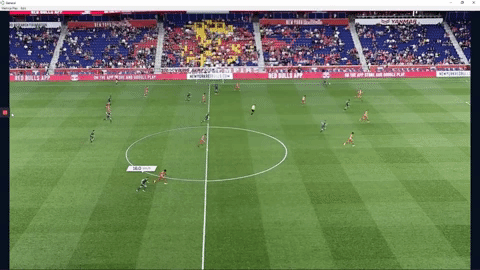

# What can you do with Metrica Play's API?
Metrica Play API for patterns and visualizations allows you to import patterns and events into Metrica Play. The intresting part is that not only it allows you to import events that have a start/end time, tags, etc; but also to add visualizations direcly from the code. For example the following json code:

```json
{
  "pattern": RCNG_PATTERN_001,
  "start_time": 5000,
  "event_time": 10000,
  "end_time": 25000,
  "coordinates": [
    [0.39,0.51],
    [0.44,0.42]
  ],
  "visualizations": {
    "start_time": 7000,
    "end_time": 23000,
    "players": "P030",
    "tool_id": "players",
    "options": {
      "speed": 1
    }
  },
  "tags": [
    "ESPBCN",
    "P030",
    "RCGN_TAG_001",
    "RCGN_TAG_007"
  ],
  "team": "ESPBCN"
}
```

This is an example of a sprint type event wihch has a `speed` visualization.  This event belongs to the `pattern` code  `RCNG_PATTERN_001`, that starts at time `5000` and ends at time `25000`, with the event indicator being located at `10000` in the timeline of the video. All times are in miliseconds. In this case, in Metrica Play the event will be located at time `10000` in the timeline that , but when you select it, the video will play from time `5000` to `25000`. 

Moreover, this event has coordiantes. There are two options for coordiantes. If you proivde just a pair of xy coordiantes, it will show a dot on the 2D field in Metrica Play. If you provide two pairs, it will show an arrow. In this case it will show an arrow in the 2D field (NOT in the video) going from `[0.39, 0.51]` to `[0.44, 0.42]`.

This event also has a annotation. In this case, the speed will show up for this player from time `7000` to `23000` for player `P030`. To code for that, the `tool_id` is set to `players` type visualization that has `speed` as `1` (true).

Finally, this event has the tags `"ESPBCN","P030",RCGN_TAG_001,RCGN_TAG_007` and belongs to the team `ESPBCN`.

And by producing this file and importing it to Metrica Play via Metrica Cloud, you'll see this result automatically. 

<p align="center">
  
</p>

# Import to Metrica Play

To import a json file to Metrica Play, you have to do it via the video project created in Metrica Cloud. To do so go to this option on your video project:
