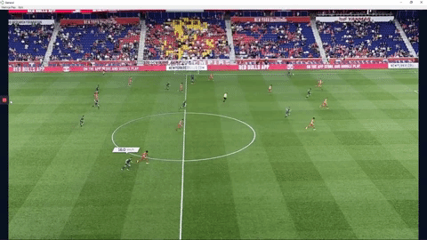

# What can you do with Play's API?

> Note that to import a pattern file to Play you do not need to use codeball. As long as the file you import is formatted as this documentation indicates you'll be able to import the file. How you create that file can be any language, any library. Codeball is one way to do it, but not the only one! Feel free to use whatever language or library/is you feel more comfortable with!

Play API for patterns and visualizations allows you to import patterns and events into Play. The interesting part is that not only it allows you to import events that have a start/end time, tags, etc; but also to add visualizations directly from the code. For example the following json code:

```json
{
  "pattern": "RCNG_PATTERN_001",
  "start_time": 5000,
  "event_time": 10000,
  "end_time": 25000,
  "coordinates": [
    [0.39,0.51],
    [0.44,0.42]
  ],
  "visualizations": {
    "start_time": 7000,
    "end_time": 23000,
    "players": "P030",
    "tool_id": "players",
    "options": {
      "speed": 1
    },
    "version": 2
  },
  "tags": [
    "ESPBCN",
    "P030",
    "RCGN_TAG_001",
    "RCGN_TAG_007"
  ],
  "team": "ESPBCN"
}
```

This is an example of a sprint type event which has a `speed` visualization.  This event belongs to the `pattern` code  `RCNG_PATTERN_001`, that starts at time `5000` and ends at time `25000`, with the event indicator being located at `10000` in the timeline of the video. All times are in milliseconds. In this case, in Play the event will be located at time `10000` in the timeline that , but when you select it, the video will play from time `5000` to `25000`. 

Moreover, this event has coordinates. There are two options for coordinates. If you provide just a pair of xy coordinates, it will show a dot on the 2D field in Play. If you provide two pairs, it will show an arrow. In this case it will show an arrow in the 2D field (NOT in the video) going from `[0.39, 0.51]` to `[0.44, 0.42]`.

This event also has a annotation. In this case, the speed will show up for this player from time `7000` to `23000` for player `P030`. To code for that, the `tool_id` is set to `players` type visualization that has `speed` as `1` (true). This visualization is also of version = 2, which means it's formatted for the new visualizations in version 2.5.0 of Play and onwards. See section Versions.

Finally, this event has the tags `"ESPBCN","P030",RCGN_TAG_001,RCGN_TAG_007` and belongs to the team `ESPBCN`.

And by producing this file and importing it to Play via Metrica Cloud, you'll see this result automatically. 

<p align="center">
  
</p>

# Import to Play
To import a json file to Play, you have to do it via the video project created in Metrica Cloud. To do so go to this option on your video project:
